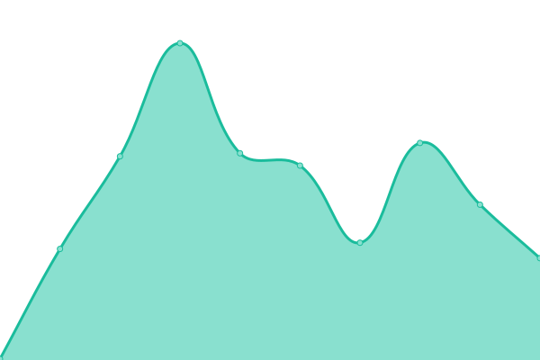
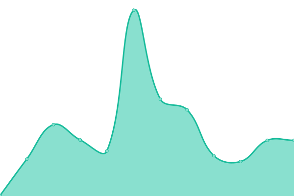
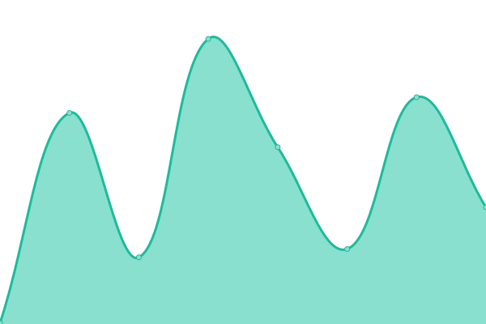
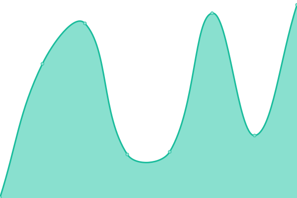

# [📈 Live Status](https://pkalyankumar1010.github.io/uptime): <!--live status--> **🟧 Partial outage**

This repository contains the open-source uptime monitor and status page for [Kalyan Kumar](https://pkalyankumar1010.github.io/uptime), powered by [Upptime](https://github.com/upptime/upptime).

With [Upptime](https://upptime.js.org), you can get your own unlimited and free uptime monitor and status page, powered entirely by a GitHub repository. We use [Issues](https://github.com/pkalyankumar1010/uptime/issues) as incident reports, [Actions](https://github.com/pkalyankumar1010/uptime/actions) as uptime monitors, and [Pages](https://pkalyankumar1010.github.io/uptime) for the status page.

<!--start: status pages-->
<!-- This summary is generated by Upptime (https://github.com/upptime/upptime) -->
<!-- Do not edit this manually, your changes will be overwritten -->
<!-- prettier-ignore -->
| URL | Status | History | Response Time | Uptime |
| --- | ------ | ------- | ------------- | ------ |
|  [Sumathi](https://sumathi.dev) | 🟩 Up | [sumathi.yml](https://github.com/pkalyankumar1010/uptime/commits/HEAD/history/sumathi.yml) | 

 354ms
     
 | 

<a href="https://pkalyankumar1010.github.io/uptime/history/sumathi">100.00%</a>
    

|  [SUMA Blog](https://blog.sumathi.dev) | 🟩 Up | [suma-blog.yml](https://github.com/pkalyankumar1010/uptime/commits/HEAD/history/suma-blog.yml) | 

 483ms
     
 | 

<a href="https://pkalyankumar1010.github.io/uptime/history/suma-blog">100.00%</a>
    

|  [Iverilog](https://iverilog.sumathi.dev) | 🟩 Up | [iverilog.yml](https://github.com/pkalyankumar1010/uptime/commits/HEAD/history/iverilog.yml) | 

 211ms
     
 | 

<a href="https://pkalyankumar1010.github.io/uptime/history/iverilog">100.00%</a>
    

|  [BEIverilog](https://locbeiverilog.sumathi.dev/api/swagger/) | 🟥 Down | [be-iverilog.yml](https://github.com/pkalyankumar1010/uptime/commits/HEAD/history/be-iverilog.yml) | 

 121ms
     
 | 

<a href="https://pkalyankumar1010.github.io/uptime/history/be-iverilog">0.00%</a>
    

|  [Snake](https://snake.sumathi.dev) | 🟩 Up | [snake.yml](https://github.com/pkalyankumar1010/uptime/commits/HEAD/history/snake.yml) | 

 208ms
     
 | 

<a href="https://pkalyankumar1010.github.io/uptime/history/snake">100.00%</a>
    

|  [Electron](https://vite.sumathi.dev) | 🟩 Up | [electron.yml](https://github.com/pkalyankumar1010/uptime/commits/HEAD/history/electron.yml) | 

 200ms
     
 | 

<a href="https://pkalyankumar1010.github.io/uptime/history/electron">100.00%</a>
    

|  [Wikipedia](https://en.wikipedia.org) | 🟩 Up | [wikipedia.yml](https://github.com/pkalyankumar1010/uptime/commits/HEAD/history/wikipedia.yml) | 

 136ms
     
 | 

<a href="https://pkalyankumar1010.github.io/uptime/history/wikipedia">100.00%</a>
    

|  [Hacker News](https://news.ycombinator.com) | 🟩 Up | [hacker-news.yml](https://github.com/pkalyankumar1010/uptime/commits/HEAD/history/hacker-news.yml) | 

 321ms
     
 | 

<a href="https://pkalyankumar1010.github.io/uptime/history/hacker-news">100.00%</a>
    

|  [Test Broken Site](https://thissitedoesnotexist.koj.co) | 🟥 Down | [test-broken-site.yml](https://github.com/pkalyankumar1010/uptime/commits/HEAD/history/test-broken-site.yml) | 

 0ms
     
 | 

<a href="https://pkalyankumar1010.github.io/uptime/history/test-broken-site">100.00%</a>
    

|  [IPv6 test](forwardemail.net) | 🟥 Down | [i-pv6-test.yml](https://github.com/pkalyankumar1010/uptime/commits/HEAD/history/i-pv6-test.yml) | 

 0ms
     
 | 

<a href="https://pkalyankumar1010.github.io/uptime/history/i-pv6-test">100.00%</a>
    

<!--end: status pages-->

[**Visit our status website →**](https://pkalyankumar1010.github.io/uptime)

## 📄 License

- Powered by: [Upptime](https://github.com/upptime/upptime)
- Code: [MIT](./LICENSE) © [Anand Chowdhary](https://anandchowdhary.com), supported by [Pabio](https://pabio.com)
- Data in the `./history` directory: [Open Database License](https://opendatacommons.org/licenses/odbl/1-0/)
